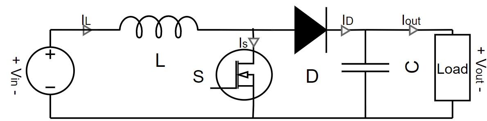

# Readme
This is a simplified explanation of what a boost converter is for people without a bachelor of Electrical Engineering knowledge.

What a Boost converter does is it boost up the input voltage while boost down the input current, since power in= power out

## Schematic of boost converter

