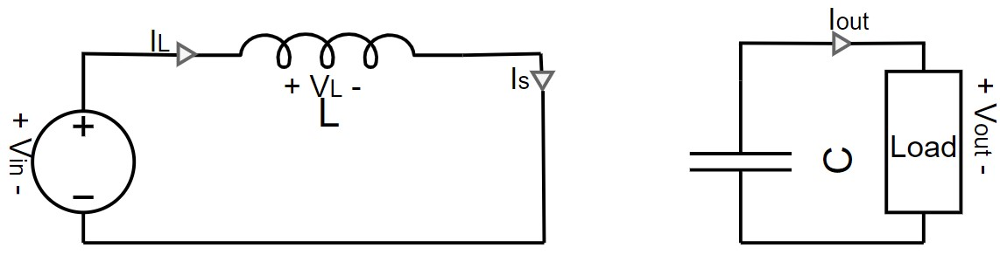
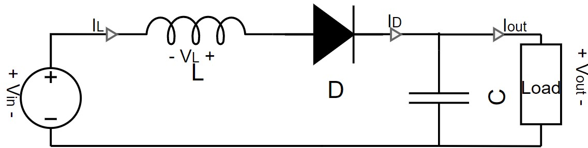

# Readme
This is a simplified explanation of what a boost converter is for people without a bachelor of Electrical Engineering knowledge. What a Boost converter does is it boost up the input voltage while boost down the input current, since power in= power out. It does this by controlling the electronic switch(S). 

## How it works
When the switch is closed a large current _I_ flows through the inductor(L) and switch(S) causing the inductor to start storing magnetic field                         . The moment that the switch opens the current flowing through the inductor will decrease since a load is now limiting the current. This change doesn't happen instantaniously due to the fact that the inductor has some "current delay". As the current decreases the stored magnetic field will collapse, this causes the stored magentic field energie to be released. Now that the inductor is releasing energy it can be seen as an additional voltage source in series to the input voltage source. So during the period that the switch is open both the input voltage source and the collaped voltage produced by the inductor goes to the output an the collapsed volatge is larger than the input voltage. These voltages are then stored at the capcaitor(C).  

When the swithch is open the voltage at the output is equal to the voltage over the capacitor, when the switch is closed the capacitor slowely discharges since it has a "voltage delay". This causes the voltage at the output to slowely decrease untill the switch is open again. The swithch is opening and closing at super fast rate>100 kHz so the sudden swithcing in output voltage is not noticed and instead the average voltage will be noticed at the output.

Now for the final component the diode (D). The diode can be seen as a wire that allows current to flow in the direction of the arrow. When the switch is open the voltage over the cap is larger than the voltage of the input source, so the capacitor will try to discharge the current towards the input voltage. To stop this the diode make sure that current can't flow back into the input source and instead goes to the output.

As for the output current, only when the switch is open current goes to the output, when the switch is closed it flows back into the battery. So the output current will be less than the input current.

## Schematic and operation of boost converter

Websimulation link:
http://www.falstad.com/circuit/circuitjs.html?ctz=CQAgjCAMB0l3BWK0BMLIHZNgBxgQGyQFYAsBICkll1CApgLRhgBQAZiOjuAJwpdCfAQGYBYaEhiQUrAErDwpUkpVhlUTaTqbqMBKwDugimAwUUQ9SsisANousnVmiNLC8MKFqTRYMOHAiPLYAJs5OYtROAqH07ACGAK52AC5GIFHOlhZCtsY52ULcUKwA5kW5Fl66rABOIMo8Tk3O0fAZrYVZhfmZ6C6tTrYA8o2kzRqkvKYabqwAblyQPIUlHgLU4vA0UsgGBSuVbazovP3RGj15yPCQELywVHB4ARgiBB+39+CnmI5zfggGaNEAANQAlgA7P4YcaTFStEEqMEAeyS6VR4AENkoYio4D00DcXGxmVYWJYoK2kAmOKJEEZrGCZIAYhA9mA4CBmCAACIYgCeAB0AM4AYUFAGM7PRWEA
## Operation mode of boost converter
### On stage

### Off stage

### Continous conduction mode (CCM),Boundry condition mode (BCM) and Discontinous conduction mode (DCM)
As mentioned before the current throught the inductor will be rising when the switch is closed and discharging when the switch is open. If the current rises and discharges above _0A_ it is in CCM. If it rises and discharges at _0A_ it is in BCM. Current can't go below _0A_ for the system so instead in the BCM it will first discharge to _0A_ and stays _0A_ untill it starts rising again. 

## Mathamatics for boost converter
First CCM since it is easier
### Inductor
General equation for inductor   
When S is closed    
When S is open    

### Transistor
When S is closed  and   
When S is open  and   

### Diode
When S is closed  and   
When S is open  and   

### Capacitor

## Simulation vs mathmatical comparison. 
