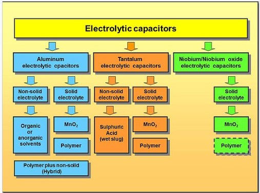
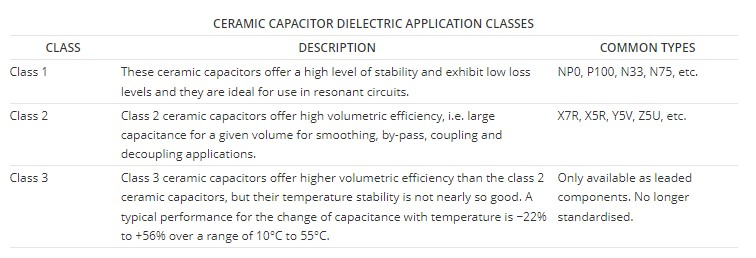
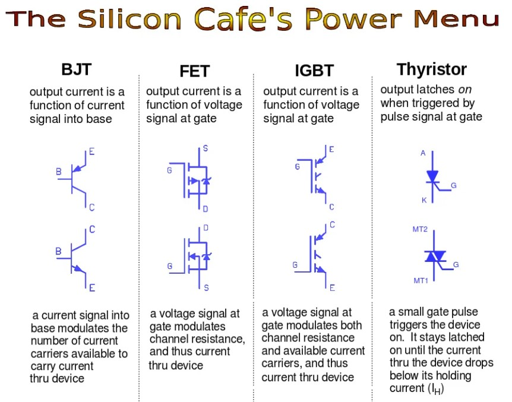
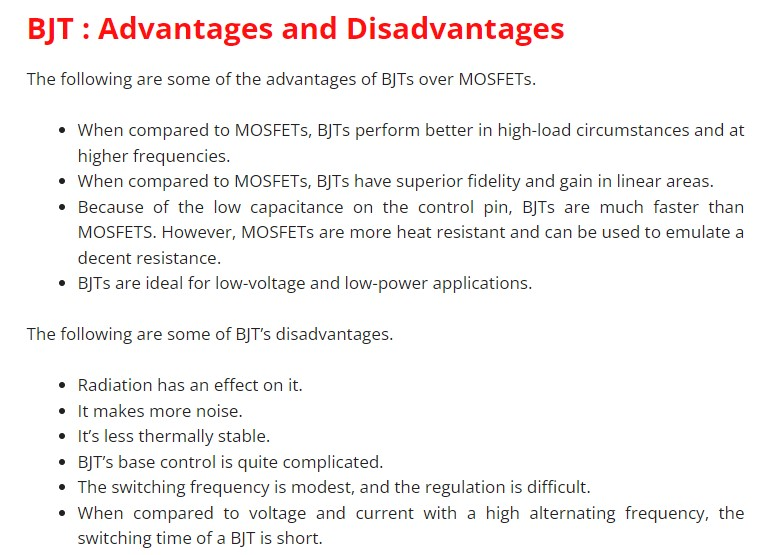
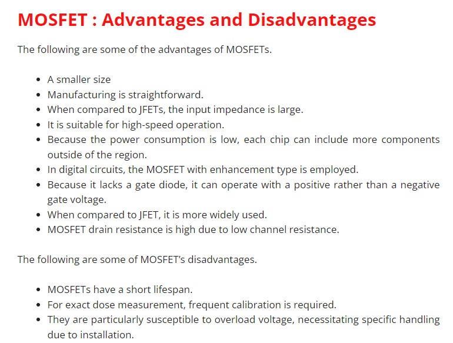
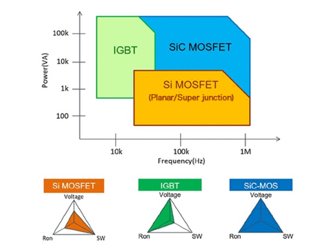

# Readme
Hi here I want to go over the components selection that were done. Material type and final values as well as an explanation as to what to pay attention to when selection component and values.

# Capacitor
Let's start with capacitor. In general there are 3 types of capacitor materials:Film capacitor, Multilayer Ceramic chip capacitor(MLCC's) and Electrolytic Capacitors (E-cap). They can be further divided into more sub catagories. More on that later. I am going to summarize the resutls in the table below. Most of the values are from the source:https://www.youtube.com/watch?v=2v8zBj7_sxg

Material | Cost | Max temp | Ripple current | Size | Mouniting | frequency range of operation | Failure rate | energy density | 26 | 276 | Typical applicitation
--- | --- | --- | --- |--- |--- |--- |--- |--- |--- |--- |---
Film | mid | $110^0 C$ | low | mid/large | mostly THT/ rare SMD | high MHz | low | high| mid | 276 | Decoupling,Filter with certain cut-off frequency,High reliability application, EMI suppresion
MLCC's| high| $200^0 C$ | mid | low | mostly SMD/rare THT | can go to GHz | low | low | 272 | 276 | Decoupling,High frequency Energy storage,Filter with rough cut-off frequency, EMI suppresion
E-cap | low | $150^0 C$ | high | mid/large |THT/SMD | low kHz | high | high | #9 | #10 | DC Link, Low frequency Energy storage
 

## Further divisions of capacitors
For E-caps, look here for detailed explanation of differences :https://en.wikipedia.org/wiki/Electrolytic_capacitor    

For Film caps:https://en.wikipedia.org/wiki/Film_capacitor

For MLCC look here for detailed explanation:https://en.wikipedia.org/wiki/Ceramic_capacitor     , source:(https://www.electronics-notes.com/articles/electronic_components/capacitors/ceramic-dielectric-types-c0g-x7r-z5u-y5v.php)

## Important parameters
* Technology
* Capacitance
* Accuracy
* ESR
* Inductance
* Frequency
* Max current
* Max temperature
* Temperature sensativity
* Power dissipation
* Size
* Cost

## Leakage and Electrical characteristics of Capacitor

In uni you learn about ideal capacitors, in the real world we can't ignore parasitics sadly.

### Measurements 

###  Real world parasitics.

On the left an ideal cap and on the right a realistic cap. The $R_{ser}$ is the series resistanc of the cap, this is why at $0.01Hz$ the input did not match the output. There is series inductor $L_{ser}$, this causes the increased impedance at higher frequency, so this is the explanation for why it started ... at ...

### How to get the parasitic values? 
1 Explicity written in datasheet 
2 They only give you a charachteristic impedance in datasheet and then you need to extract them 
3 They give you a Spice model and you use that for simlations
 
I will use method 2 for the values.

### LTspice vs actual model

### Make it more accurate?

### Other important parameters that effect capacitors
Other important parameters that are usefull to know is how the capacitor changes due to temperature, applied voltage (DC bias voltage) and ripple current

### Spice vs measured comparason

## Understanding capacitor datasheet 

# Inductor

# Diode

# Transistor
## Technologies
 
source:https://www.allaboutcircuits.com/technical-articles/fet-vs-bjt-vs-igbt-whats-the-right-choice-for-your-power-stage-design/

Low power 

   
   

source:https://wiraelectrical.com/bjt-vs-mosfet-difference/

High Power 
 
source:https://techweb.rohm.com/knowledge/

## Important parameters when picking technology
* Voltage rating
* Switching frequency
* Conduction losses

