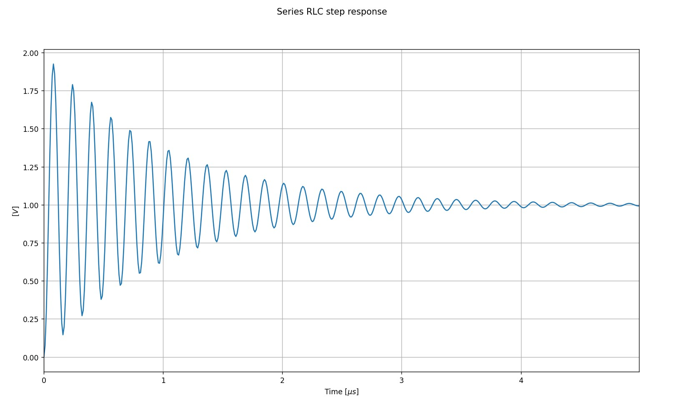

# Readme
The magic of controls engineering. 

# Series RLC Step responce
Here you can see how R,L and C can effect a step responce. 

## Differential equation
$v_{in}(t)-v_{R}(t)-v_{L}(t)-v_{C}(t)=0$ (KVL)  
$v_{R}(t)=R i(t)$  
$v_{L}(t)=L \frac{d i}{d t}$  
$i(t)=C \frac{d v_{C}}{d t}$ 

## Transfer Function
First rewrite it in Laplace 
$V(s)-V_{R}(s)-V_{L}(s)-V_{C}(s)=0$ 
$\frac{d}{d t}=s$ 
$V_{R}(s)=R I(s)  $ 
$V_{L}(s)=L s I(s)$ 
$I(s)=C s V_{C}(s)$

Rewritting everything gives $\frac{V_{C}(s)}{V(s)}=\frac{1}{R C s+L C s^{2}+1}$, since $V_{C}=V_{in}$ it becomes $H(s)=\frac{1}{R C s+L C s^{2}+1}$

Example 
$R=22 \Omega$  
$L=11.3 uH$ 
$C=58 pF$ 
gives the following result. The code can be found at .. 
.

