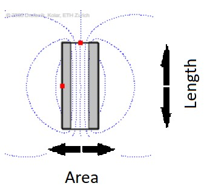
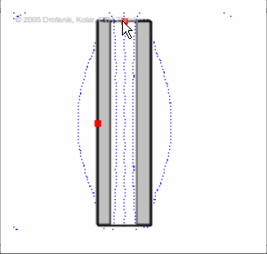
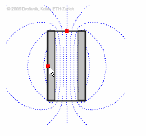
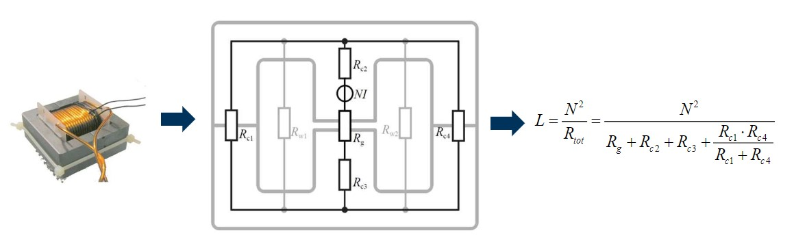
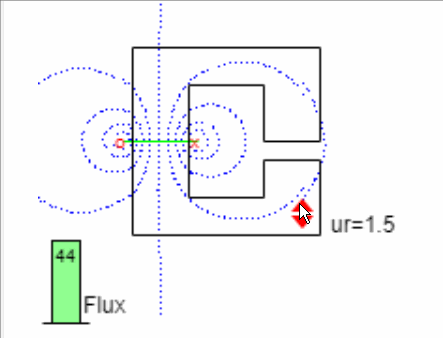
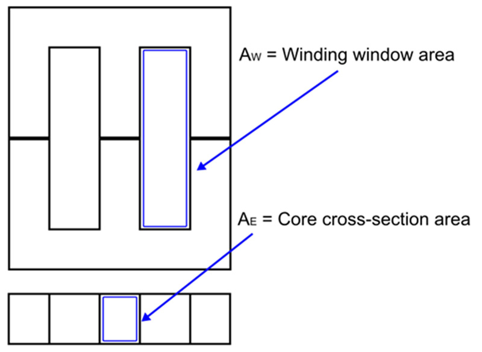

# Readme
This folder explains how I made the inductor, then how well it worked compared to the practical model. They main purpose of these experiments are to compare DCM and CCM and also MOSFET and IGBT technology. For DCM and CCM the same input,output,switching frequency and duty cycle. For IGBT vs MOSFET they have different everything except input voltage. The reason is I just went with the value given to me, I tried researching and thinking of my own values but it was wasting time and leading nowhere, so I chose what the uni chose. 

## Inductor theory
An inductor is a passive electronic componen which can store electrical energy in the form of magnetic energy. I am going to assume the reader knows about magnetic circuit model. If not, please read [this](https://automationforum.co/difference-between-the-electric-circuit-and-magnetic-circuit/) or [this](https://dipslab.com/difference-electrical-magnetic-circuit/). The resistor analogy was used to find the inductance of the circuit. For this the flux linkage equation $\lambda=N\phi=L i$ and the flux equation $\frac{Ni}{R_m}$ were combined to get $L=\frac{N^2}{R_m}$, where $N$ is the number of turns and $R_m$ is the reluctance of the material. The general equation for reluctance is $R_m=\frac{l}{\mu_0 \mu_r A}$, which looks similair to the equation for resistance $R_m=\frac{l}{\sigma A}$.
The inductance equation can be rewritten as $L=\frac{N^2 \mu_0 \mu_r A}{l}$. Looking at the second image below where the length keeps changing, if the lenght decreases the inducance increases and this causes more magnet field to circulate around the inductor.For the simulation Ni remains constant. Thus if the length of the inductor increases the inductance decreases and thus less magnetic field is stored. Changing the area has the opposite effect as area increases inductance increases and as area decreases the inductance decreases. These simulations were done with on online finite element method (FEM) simulator from https://www.ipes.ethz.ch/mod/lesson/view.php?id=22

   
  
  

 Just like with a electrical model where the current going through the circuit is $i=\frac{V}{R_{tot}}$ the magnetic circuit's inductance is $L=\frac{N^2}{R_{tot}}$.
 

In practice magnetic fiels leaks to the air this is knows as leakage inductance. A way to minimize this is to take a material with high $\mu_r$ the simulation below shows the effect increasing the material's permeability has on the effective flux being produced. The green bar represents the magnitude of the magnetic flux between the two current carrying conductors. 
 

## Design requirements
* Size, the smaller the better
* Efficiency, the higher the better
* EMI, as low as possible
* Temperature, as low as possible
* Cost, as low as possible

## Theoretical design 
The steps taken to design this inductor are from the different articles in the article folder, with some modifications in steps taken. 

### Application
 * This is a boost converter so it is a single winding inductor.
 * I will operate in both CCM and DCM mode.

### Step 1  Needed input paramters
* Inductace value $L$
* Operaton frequency $f$
* Current peak $i_{peak}$
* Current RMS Inductor $i_{rms}$
* Operation mode CCM/DCM
* Allowable power dissipation $P_{core}$
* Maximum surface temperature of the inductor $T_s$

### Step 2  Assumption parameter
* $k_w$ is the window area utilization, typical values are $k_w\approx 0.4 ... 0.6$. This factor is needed since the entire winding window can't be fully filled with copper wire. A portion of the area will be used up by the insulating material and airgaps that can't be avoided.
* $J_{RMS}$ limited to avoid excessive heat inside th e coil, values are $J_{RMS}\approx 4 ... 5 A/mm^2$. Lower current density results in lower ohmic power loss. But it comes at the cost of larger wires, since $J=\frac{i}{A}$.
* $B_{max}$ limited due to saturation of th e core material, values are $B_{Max}\approx  0.6 .. 0.8 B_{sat}$, lower $B_{Max}$ gives larger safety margin against saturation, however it comes at the cost of a larger inductor volume.

### Step 3 Core materials type https://en.wikipedia.org/wiki/Magnetic_core#Core_materials and https://www.researchgate.net/publication/340073905_Advanced_Ferromagnetic_Materials_in_Power_Electronic_Converters_A_State_of_the_Art
* Iron based
* Powder metal
* Ferrites

Read wiki for full detail

### Step 4 core shape types
* E core
* ETD core
* I core
* Toroidal core
* Ring or bead

Pick the shape that fits your application

### Step 5 pick the size
Obviously the smaller the better

$A_P=\frac{L\cdot i_{peak} \cdot i_{RMS}}{kw \cdot J_{RMS}\cdot B_{max}}$

$A_P= A_w A_\epsilon$

Now you need to pick the shaps, whose $A_P$ is larger than the one calculated.

### Step 6 calculate number of turns

$N=\frac{L i_{peak}}{B_{max} A_\epsilon}$

### Step 7 calculate air gap

$l_{air}=\frac{N^2 \mu_0 A_c}{2L}$

### Step 8 modify air gap or number of turns if needed
A too large air gap results in a lot of lost magnetic field and too many turn can result in larger conduction losses. These are 2 reasons as to why either of the both parameters may need to be tuned. The benefit of the previous steps is that it gives a good starting point. Now either the airgap or the number of turns need to be modified, while still staying in $B_{max}$. Either of the following equations can be used to find the new parameters. $N=\sqrt{\frac{2L l_{air}}{\mu_0 A_c}}$ or l_{air}=\frac{N^2 \mu_0 A_c}{2L}.

### Step 9 wire thickness

The wire thickness has an effect on the conduction losses, skin and proximity effect.

The skin dept sets the upper limit for wire thickness. For this $\delta=\sqrt{\frac{1}{\mu_0 \mu_r \pi \sigma_{copper} f_{sw}}}$ is used. 
The $J_{RMS}$ sets the lower limit for wire thickness. With $A_{wire}=\frac{i_{rms}}{J_{RMS}}$ 
Larger wires have worse proximity effect losses. The equation is quite scary so I won't add it.

### Step 10 inductor temperature

## Constructing an inductor

### Materials
* 2 Magnetic cores
* Bobbin
* 2 Metal clamps
* Chosen wire for turns
* Some materials to construct the needed airgap

### Tools
* Wire cutter
* LCR meter
* 

### End product

## Designed inductor

### MOSFET
#### Given parameters for both modes
* $V_{in}=45V$
* $V_{out}=150V$
* $f_{sw}=80 kHz$
* $D=0.7$
* $\Delta$,Ripple factor Peak-Peak during CCM mode is 0.4

### MOSFET transistor CCM mode

#### Important inductor parameters
* $L=\frac{D V_{in}}{f_{sw}\Delta  i_{in}}$
* $L=0.75mH$
* $\Delta I_{L}=\frac{ D V_{in} }{L f_{sw}}$
* $\Delta I_{L}=0.5 A$
* $i_{rms}=\sqrt{\left(\frac{I_{o}}{1-D}\right)^{2}+\frac{\Delta I_{L}^{2}}{12}} $
* $i_{rms}=1.25 A$
* $i_{peak}=i_{rms}+0.5*\Delta I_{L}$
* $i_{peak}=1.5 A$

#### Design
* 3C90 core
* ETD44 core shape
* Number of turns=39
* Airgap=0.2mm
* Wire chosen 26 AWG
* $B_{max}=$ 0.25 Tesla

#### Simulation
For simulation the program femm was used, because it is free and good enough for simple FEM simulation. https://www.femm.info/wiki/HomePage, here are some tutorials, https://www.youtube.com/watch?v=5LvWE1JscO4 , 

#### Practical model

### MOSFET transistor DCM mode

#### Important inductor parameters
* $L=\frac{D^2 R V_{in}}{2 V_{out} f_{sw} (V_{out}-V_{in})} $, rewrite the duty cycle equation for DCM
* $L=0.16mH$
* $\Delta I_{L}=\frac{ D V_{in} }{L f_{sw}}$
* $\Delta I_{L}=2.5 A$
* $\Delta_1= \frac{2 V_{out}L f_{sw} }{D R V_{in}} $
* $\Delta_1=  0.3 $
* $i_{rms}=\sqrt{\left(D+\Delta_{1}\right) \frac{\Delta I_{L}^{2}}{3}} $
* $i_{rms}=1.4 A$
* $i_{peak}= \frac{V_{in} D}{L f_{sw}}$ [Reason](https://www.youtube.com/watch?v=6RuPplUim4E&list=PLmK1EnKxphinxBub5hL0ZoJXWoqjkGE19&index=36)
* $i_{peak}=2.5 A$

#### Design
* 3C90 core
* ETD44 core shape
* Number of turns=17
* Airgap=0.2mm
* Wire chosen 26 AWG
* $B_{max}=$   Tesla

#### Simulation
#### Practical model

### IGBT
#### Given parameters for both modes
* $V_{in}=45V$
* $V_{out}=300V$
* $f_{sw}=15kHz$
* $D=0.85$
* $\Delta$,Ripple factor Peak-Peak during CCM mode is 0.5

### IGBT transistor CCM mode
#### Important inductor parameters
* $L=1mH$ 
* $i_{rms}=  5 A$
* $i_{peak}=  6.3 A$

#### Design
* 3C90 core
* ETD54 core shape
* Number of turns= 87
* Airgap=1.3mm
* Wire chosen 18 AWG
* $B_{max}=$ 0.22 Tesla
#### Simulation
#### Practical model

### IGBT transistor DCM mode
#### Important inductor parameters
* $L= 0.25mH$ 
* $i_{rms}=  5.8 A$
* $i_{peak}=  10 A$
#### Design
#### Simulation
#### Practical model
