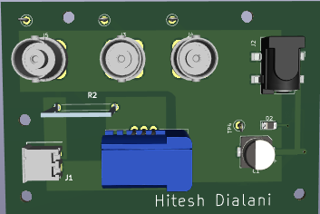
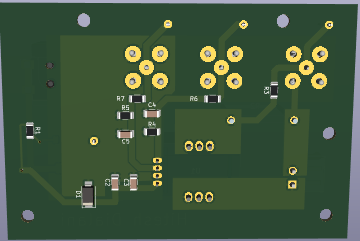

# Read me

The V1 model is the one that was made by uni, but I converted it from Altium to Kicad.

# V1 design
The image below is the Schematic for V1 current PCB design

The image below is the routing for V1 current PCB design

   
  

The image below is a 3D model for V1 current PCB design

   
  
  

