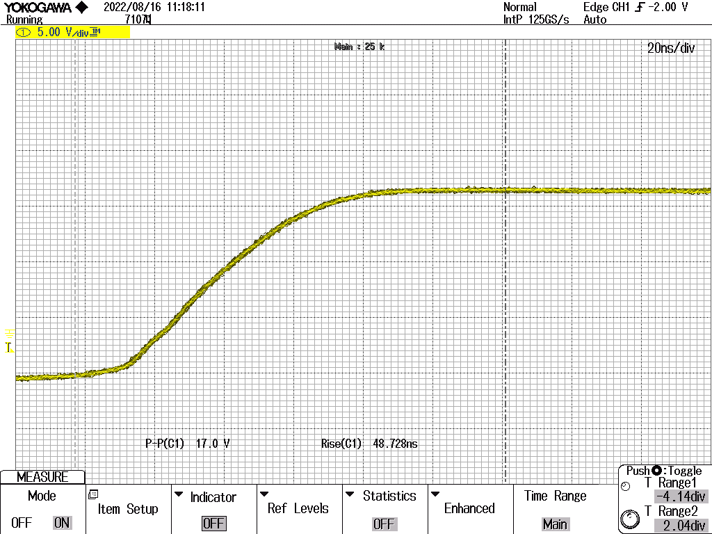
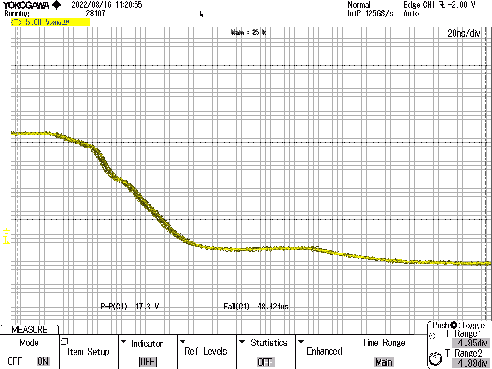

# Read me

The micro-controller will sent PWM signal with the desired duty cycle to the gate drivers, which will then send the  desired square waves to the chosen transistor.


The micro-controller will send a PWM signal from 0V-3V3 or 0V-5V depending on which micro-controller is used. As will be explained a bit later this  is not the desired signal for power transistors it is fine for normal low power transistors though. So for power transistors a gate driver circuit is needed. This signal will boost and PWM logic signal to the desired square waves.

# Why is the gate driver needed?


## Parasitic capacitor
In an ideal world transistors would turn on instantly. However in the real world it takes some time till the a transistor is switched from "OFF" to "ON". This is because there a parasitic capacitance between the gate and source of the MOSFET.(This explanation uses MOSFET, but the same can be said about IGBT). This parasitic capacitance causes the transistor to turn on very slowely. Normally these switches take a few $ns$-$us$ so a little delay isn't that bad, however to big problem comes from what happens in between of going from turning "OFF" to "ON". Here "ON" means $V_{DS}$=$0V$. For those that don't know MOSFET's have 3 operating regions: cut-off region, resistive/linear region and saturation region. Read this if you want to understand more [read this](http://electricalarticle.com/power-mosfet-construction-operation-iv-characteristic/) or [watch this](https://www.youtube.com/watch?v=o3M2sOCGCKs). Ps a very common confusion is between saturation and linear region. For the BJT both regions name are swapped 🙃 look at this [fun thread](https://electronics.stackexchange.com/questions/498561/in-which-region-should-a-mosfet-be-operated-as-a-switch). 

So now that you know all the 3 regions are you can understant what the problem is when the with a switch turning "ON" very slowely. The switch will be in the saturation region for a long time. During the saturation region current will flow througt the MOSFET while there is still a voltage difference between drain and source, so there wil be a lot of power lost over the transistor. The animation below shows this effect the MOSFET is first in cut-off then due to the parasitic capacitor it stays in saturation for a while then it finally enters linear region. A problem with micro-controllers are that they can't give a lot of charge. The usuall give between $4-20mA$. So this will cause the capacitor to take forever to charge. For a power MOSFET it will take ages since it's parasitic cap is extremely large. So the gate driver steps in and deliver a large amount of current compare to the micro-controller thus charging the parasitic capacitor faster. Besides the charging of this capacitor the gatedriver also discharges this capacitor. Power MOSFET's have large parasitic caps, so even if you remove positive voltage the gate voltage can stay the same voltage for a while. So to quickly discharge this capacitor the gate driver supplies negative voltage to turn the transistor "OFF".  


<br>

<br>
http://www.falstad.com/circuit/circuitjs.html?ctz=CQAgjCAMB0l3BWcMBMcUHYMGZIA4UA2ATmIxAUgpABZsKBTAWjDACgAncMFEFGqmAyE+AqMjYAlbr36CefPHnFUxTJFU3QEbAMqiqKfuGF9jmkADMAhgBsAzg3EpOi5T2Uol4QhcqQ2AHcQbGwRTFlvCKgpGT58OI8VWioNFW1XVlkEoXCEwQCAYwMzGhLorUgIJhgyPBoEBoRCNEbIbGUAy3LjL09jbFkoWBdgvvKojF4AsbFo8Yq2AHM3PinV3DLNINW0T28wXxjpcaTx4hELMTStHTGohNC8zrY0cjlSksPVEABxawALgwAPoANwA9rYAdYlgw2OCQMpCFsUmRqDB4JAyIRmig0rxlNh4YiQMiQOQBKR0dAIIJhpjhChiNhiA1sDwdAiwEgyaoscoNDTwHxwEgiQikSjKeRBZjsbikENCcTJeTUcRqRBeLTYPBGczWQh2Xi2EA

## Lower conduction losses

Another reason as to why to use a gate driver is that it can boost the 3V3-5V voltage to higher voltage. The benefit becomes more clear when looking at a typical power MOSFET's I-V curve, The image below is from the SCTWA30N120. 
<br>


The larger $V_{GS}$ is the larger the slope becomes. Since $R=V/I$ a larger slope results in a smaller resistance. Even thought these resistance are already in the $m\Omega$ range this play a huge role in conduction loss, since I is usually very large. Therefor it is more desirable to have the highest possible $V_{GS}$. With gate drivers their output voltage is dependend on the voltages that are supplied to it. So for example the NCP81080 [datasheet](https://www.onsemi.com/pdf/datasheet/ncp81080-d.pdf) can supply $20V$ to turn the switch "ON" and supply $-5V$ "OFF". The max possible voltage is transistor dependend so check its dataheet to see the max possible voltage both positive and negative.

## Isolation between HV and LV ground

And finally another reason to use a gate driver is to make sure that the LV part of the PCB is safe from the HV part. ToDo..........

# Simple inverter circuit
I will first build a simple inverted circuit and then see what happens.

## Ideal case simulation results


<br>
http://www.falstad.com/circuit/circuitjs.html?ctz=CQAgjCAMB0l3BWcMBMcUHYMGZIA4UA2ATmIxAUgpABZsKBTAWjDACg1ywU8QUUa4HuAyFaIAGoATAM4dI5KgKpUwxFOIkBzOQHcQxMSgRjDIXIMht9ZiyDxU7V-Y8iCH5t1GtQ+NKjS8yt4Abr5Ofip8fEpUTEgq0Ag+ZvyC3EEC3gBKBmJgonngNJa+-hRRickATkVpRQViqvBsWkV2tmi+VgBmtEHlqeXYGmBJULAobAD24CCEpf7EvB4w8JBkhCbGZXP0leZsQA

## Measurement

Materials
* Power supply
* Gate driving circuit driven by a pre-programmed micro-controller
* Oscilloscope
* Current limiting resistor
* Wires
* Transistor

The setup is shown below
```diff
  MISSING IMAGE
```
### MOSFET version
* Power supply voltage= $45V$
* Gate driver IC = ACPL-344JT
* Gate driver IC supply voltage +12/-5V
* Gate resistance= $8.2\Omega$( Will explain this function later)
* Current limiting resistor value $22\Omega$
* SiC MOSFET =c3m0075120k
* Duty cycle 85%
* Switching frequency $80 kHz$ 

#### Only $V_{GS}$ 
 So pretty much as expected. <br>


Now lets zoom in a bit. Left is the rise voltage and right is the fall voltage.

<p float="left">
   
   
</p>

So it is physically impossible to go from $-5V$ to $12.5V$ or vise versa instantaniously, as mentioned above there are parasistic capacitors and there is a gate resistor present. So while the capacitor is charging the voltage should look like a typical [RC charge circuit](https://www.electronics-tutorials.ws/rc/rc_1.html). And while it is discarging it should look like a typical  [RC discharging circuit](https://www.electronics-tutorials.ws/rc/rc_2.html). But in reality Miller platue stops the voltage for a time period as can be seen during fall. Some resources regarding Miller Plateau read [1](https://inst.eecs.berkeley.edu/~ee192/sp17/files/MOSFET_as_switch.pdf) and [2](https://electronics.stackexchange.com/questions/66660/why-is-the-gate-charge-curve-miller-plateau-of-mosfets-dependent-on-vds) or watch [3](https://www.youtube.com/watch?v=f1yt0s3gpcE)  

```diff
  Why no Miller plateau during rise?
```
#### $V_{GS}$, $V_{DS}$ and $I_{R}$  

### IGBT version


# Boost converter circuit

## MOSFET
 
## IGBT
 
