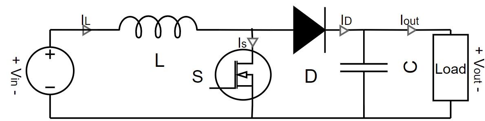
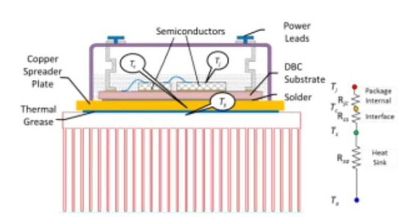
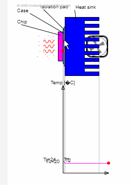

# Readme
This will explain what gets hot, how to calculate the temperature rise, measure and compare finally compare theory and practic.

## What gets hot

Looking at the model either the inductor(L),transistor(S),capacitor(C), diode(D) or load can get hot. 

## How to calculate the temperature rise
 For the transistors and diode they follow the same top level approach. Since these are used in "high power" application a heatsink is needed, else they will fry. shows a cross section of chip on heatsink and below that you can see the how the heat transferes. 
 
 source:https://www.electronics-cooling.com/2017/07/advanced-cooling-power-electronics/

A nice overview of each component and how they effect the temperature of the IC.
 
 source:https://www.ipes.ethz.ch/mod/lesson/view.php?id=16
