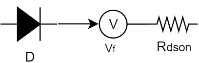
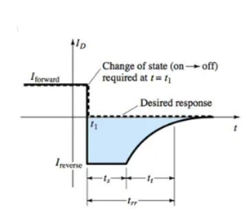
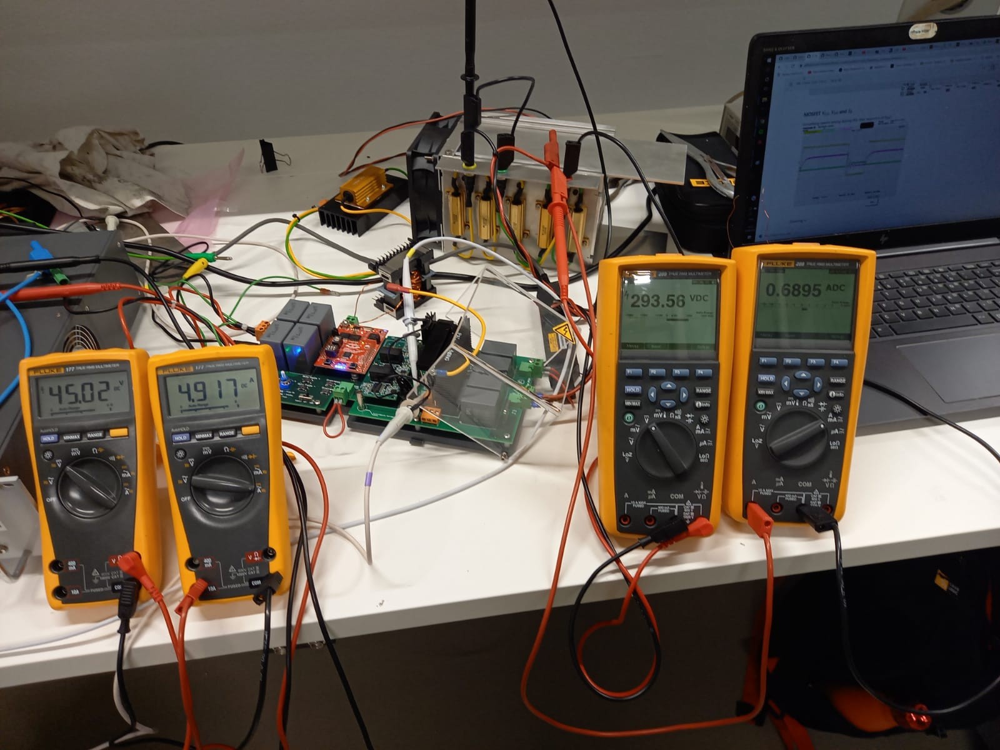

# Readme
This will explain what gets hot, how to calculate the temperature rise, simulate it, measure it and finally compare theory and practic. If components get too hot they can explode. So it is important to understand heat and to make sure things don't get too hot. Heat is generated by losses, so the best way to make sure something doesn't get to hot is to have an extremly efficient system, but even with the most efficient system cooling might be needed due to the amount of power going through the system. Another way is to transfer the heat produced from the hot object(component) to a cold object(cooling method), just like using ice to cool off during summer. 

# What gets hot

Looking at the model either the inductor(L),transistor(S),capacitor(C), diode(D), the load and/or the wires connecting everything can get hot. 

# How to calculate the losses of different components

## Resistive load

### Conduction
The losses can be calculated as $P_{resisitive} [W]=I_{out}^2 [A] \cdot R_{load} [\Omega]$. If a single resistor is used it will get all the losses, but if multiple resistors are used the $P_{resisitive}$ is divided over the resistors. Once losses it known now the thermal resistance, which is ususally given with the symbol $R_{\theta}$ in $[^{\circ}C/W]$ of load is needed. So the final equalibrium temperature of the load without any cooling can be calculated as $T_{resistor}=I^2 \cdot  R \cdot R_{\theta}$. The speed in which the load reaches is dependend on the thermal capacitance, which is usally given with the symbol $C_{\theta}$ in $[J/K]$. The larger the thermal capacitance the longer it will take till for the load to reach its equilibrium state. Think of it as a RC Charging Circuit, but with temperature instead of voltage.

## Diode

### Conduction
Before calculuting the theoretical temperature rise of an diode it is important to understand what causes losses in and inductor. There are 2 types of losses conduction losses and switching losses. Conduction loss  happens when the diode is not blockin the current from flowing. Switching loss is when the diode is turnin on or off and there is still current present during the transition.For the conduciton there are 2 sources of losses, its resistance during the period when it is conduction $R_{dson}$ and the forward voltage drop $V_{f}$.
So its conduction loss can be calculated as $P_{diode-conduction}=V_{f}*I_{out}+R_{dson}*I_{out}^2$. 
 

### Switching loss
Next is the switching loss. In an ideal world when positive voltage is applied a diode conducts and then if a negative votage is instantly applied no current flows through the diode. Look at the image below the dotted lines. In practice this does sort of happen when a positive voltage is applied current conduct through the diode and when negative voltage is applied no current flows throught the diode, however what happens in between transistion is where it the difference appears. In practice you get the image on the right(The straight line with blue area). Watch these [1](https://www.youtube.com/watch?v=DT8kCmXbSDg) [2](https://www.youtube.com/watch?v=SBqLOrlA7QI). During reverse recovery current the circuit is negative. When the switch is closed the inductor side is stuck on ground and when the switch is open $V_{source}+V{L}>V_{out}$. So during reverse recovery the switch is going from open to closed. So there is a negative voltage over the diode. So that gives a positive power value, thus power is lost. The interesting question is where does this power lost go to ?   
The reverse recovery loss can be calculated as $P_{reverse-recovery}[W]=Q_{rr}[C]*f_{sw}[1/s]*V_{out}[V]$  
. Source:https://www.electrical4u.com/reverse-recovery-time-of-diode/
 
Interesting note regarding the reverse recovery decreasing the parasitic inductance won't change the area of the blue region. It will only make the $di/dt$ sharper thus making more EMI. Higher forward current will also cause this loss to increase. So the only way to minimize this is to operate the diode at lower current or pick the correct diode for the job. For thos interested a schottcky diode is the [answer 1](https://www.quora.com/Why-is-reverse-recovery-time-is-nearly-zero-in-Schottky-diode) [answer 2](https://electronics.stackexchange.com/questions/200507/what-exactly-determines-recovery-time-of-schottky-diodes). Ps any SiC diode is a schottky diode [magic](https://www.powerelectronicsnews.com/examining-a-sic-diode/). 
  
## Transistor

Just like the diode the transistor has a conducting and switching loss. The conduction loss eqaution for a MOSFET and IGBT are different, but the switching loss is te same.

### Conduction losses
For the IGBT it is exactly the same as the diode $P_{IGBT-conduction}=V_{f}*I_{out}+R_{dson}*I_{out}^2$. For the MOSFET during triode/ohmic region it acts as a resistor, so the constant voltage drop charachteristic can be remove and this the loss can be calculated as $P_{MOSFET-conduction}=R_{dson}*I_{out}^2$

### Switching losses

## Inductor

Rip

## Capacitor
Rip

## Wire

There is only resistive losses due to the copper so $P_{copper} [W]=I^2 [A] \cdot R_{copper} [\Omega]$

# How to calculate temperature rise

# Cooling options

So the following are the commenly used cooling options: Air, forced air cooling, heatsink, heatsink and forced air and water cooling. Each of them have their own pros and cons.

Method                 | Cost                                                               | Cooling effect  |Space               | Effort | Risk
---                    | ---                                                                | ---             | ---                | ---    | ---
Air                    | Free                                                               |                 |Takes no extra space|        |        
Forced air             | Needs fans,powersupply for fan and optional PWM controller for fan |                 |      |        |
Heatsink               | Needs a big piece of metal with fins                               |  
Heatsink and forced air| Needs both the above mentioned things                              |
Water cooling          | Needs water, tubes, pump with powersupply and controller to move water and reservoir to store water|  

# Fix this later
For the transistors and diode they follow the same top level approach. Since these are used in "high power" application a heatsink is needed, else they will fry. shows a cross section of chip on heatsink and below that you can see the how the heat transferes. 
 
 source:https://www.electronics-cooling.com/2017/07/advanced-cooling-power-electronics/

A nice overview of each component and how they effect the temperature of the IC. 
 
 source:https://www.ipes.ethz.ch/mod/lesson/view.php?id=16

# MOSFET CCM

## Calculated final temperatures

## Tools
* Patience
* Device under test (DUT)

## Results

## Breakdown of losses and  final efficiency

Looking at the image below it can be calculated that the total systems efficiency is $100\cdot\frac{P_{out}}{P_{in}}=$ 100 $\cdot$ 0.3517 $\cdot$ 150.01 /(1.229 $\cdot$ 45.01)=95.35% 

# IGBT CCM

## Calculated final temperatures

## Tools
* Patience
* Device under test (DUT)

## Results

## Breakdown of losses and  final efficiency

Looking at the image below it can be calculated that the total systems efficiency is  
Looking at the image below it can be calculated that the total systems efficiency is $100\cdot\frac{P_{out}}{P_{in}}=$ 100 $\cdot$ 0.6895 $\cdot$ 293.56 /(4.914 $\cdot$ 45.02)=91.44% 

