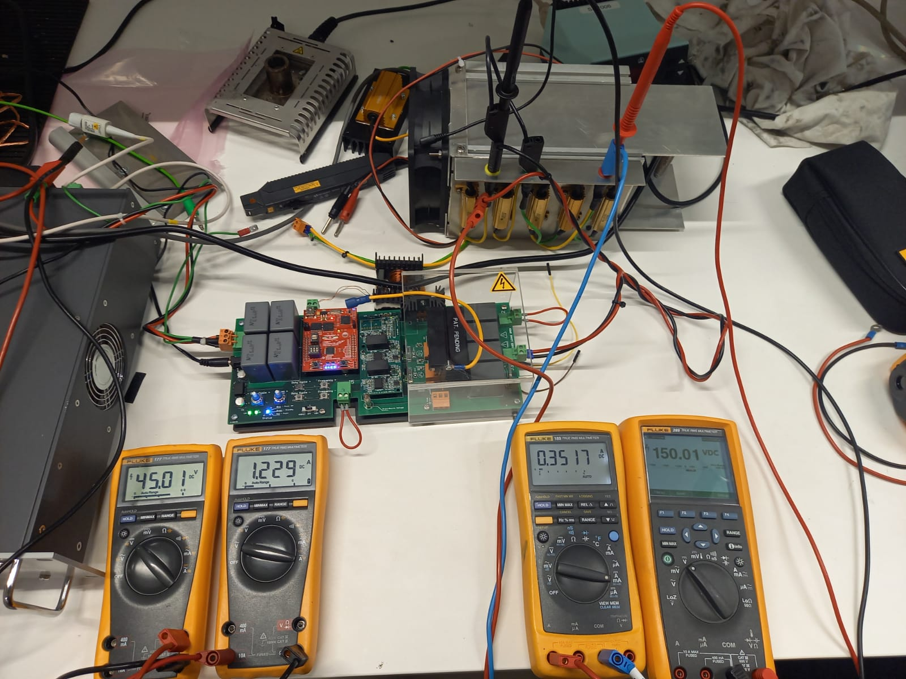

# Readme
This will explain what gets hot, how to calculate the temperature rise, simulate it, measure it and finally compare theory and practic. If components get too hot they can explode. So it is important to understand heat and to make sure things don't get too hot. Heat is generated by losses, so the best way to make sure something doesn't get to hot is to have an extremly efficient system, but even with the most efficient system cooling might be needed due to the amount of power going through the system. Another way is to transfer the heat produced from the hot object(component) to a cold object(cooling method), just like using ice to cool off during summer. 

# What gets hot

Looking at the model either the inductor(L),transistor(S),capacitor(C), diode(D), the load and/or the wires connecting everything can get hot. 

# How to calculate the temperature rise

## Resistive load

The losses can be calculated as $P_{resisitive} [W]=I_{out}^2 [A] \cdot R_{load} [\Omega]$. If a single resistor is used it will get all the losses, but if multiple resistors are used the $P_{resisitive}$ is divided over the resistors. Once losses it known now the thermal resistance, which is ususally given with the symbol $R_{\theta}$ in $[^{\circ}C/W]$ of load is needed. So the final equalibrium temperature of the load without any cooling can be calculated as $T_{resistor}=I^2 \cdot  R \cdot R_{\theta}$. The speed in which the load reaches is dependend on the thermal capacitance, which is usally given with the symbol $C_{\theta}$ in $[J/K]$. The larger the thermal capacitance the longer it will take till for the load to reach its equilibrium state. Think of it as a RC Charging Circuit, but with temperature instead of voltage.

## Diode
Before calculuting the theoretical temperature rise of an diode it is important to understand what causes losses in and inductor. There are 2 types of losses conduction losses and switching losses. Conduction loss  happens when the diode is not blockin the current from flowing. Switching loss is when the diode is turnin on or off and there is still current present during the transition.For the conduciton there are 2 sources of losses, its resistance during the period when it is conduction $R_{dson}$ and the forward voltage drop $V_{f}$.
So its conduction loss can be calculated as $P_{diode-conduction}=V_{f}*I_{out}+R_{dson}*I_{out}^2$. 
 
 
Next is the switching loss.
 
## Transistor
For the transistors and diode they follow the same top level approach. Since these are used in "high power" application a heatsink is needed, else they will fry. shows a cross section of chip on heatsink and below that you can see the how the heat transferes. 
 
 source:https://www.electronics-cooling.com/2017/07/advanced-cooling-power-electronics/

A nice overview of each component and how they effect the temperature of the IC. 
 
 source:https://www.ipes.ethz.ch/mod/lesson/view.php?id=16
 

## Inductor

## Capacitor

## Wire

# Cooling options

So the following are the commenly used cooling options: Air, forced air cooling, heatsink, heatsink and forced air and water cooling. Each of them have their own pros and cons.

Method                 | Cost                                                               | Cooling effect  |Space               | Effort | Risk
---                    | ---                                                                | ---             | ---                | ---    | ---
Air                    | Free                                                               |                 |Takes no extra space|        |        
Forced air             | Needs fans,powersupply for fan and optional PWM controller for fan |                 |      |        |
Heatsink               | Needs a big piece of metal with fins                               |  
Heatsink and forced air| Needs both the above mentioned things                              |
Water cooling          | Needs water, tubes, pump with powersupply and controller to move water and reservoir to store water|  

# MOSFET CCM

## Calculated final temperatures

## Tools
* Patience
* Device under test (DUT)

## Results

## Breakdown of losses and  final efficiency

Looking at the image below it can be calculated that the total systems efficiency is $100\cdot\frac{P_{out}}{P_{in}}=$ 100 $\cdot$ 0.3517 $\cdot$ 150.01 /(1.229 $\cdot$ 45.01)=95.35% 

# IGBT CCM

## Calculated final temperatures

## Tools
* Patience
* Device under test (DUT)

## Results

## Breakdown of losses and  final efficiency

Looking at the image below it can be calculated that the total systems efficiency is  
